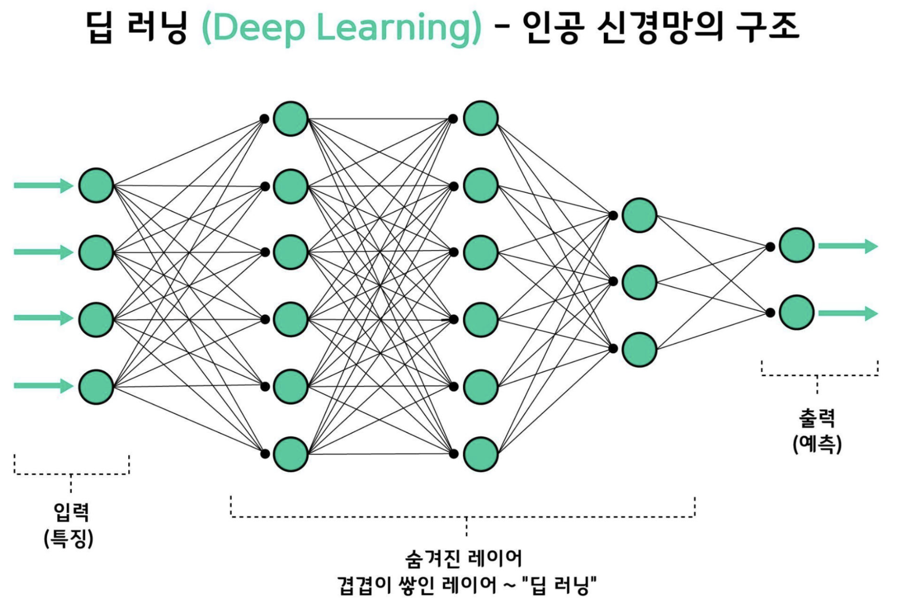
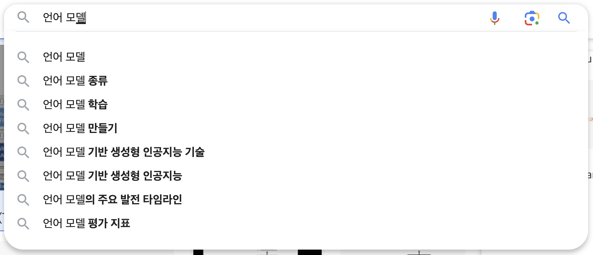
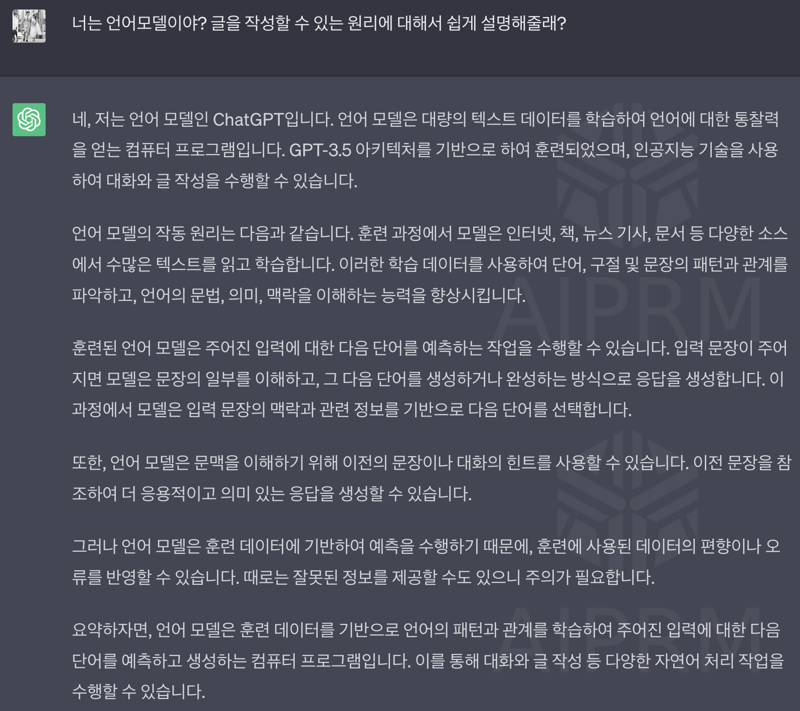
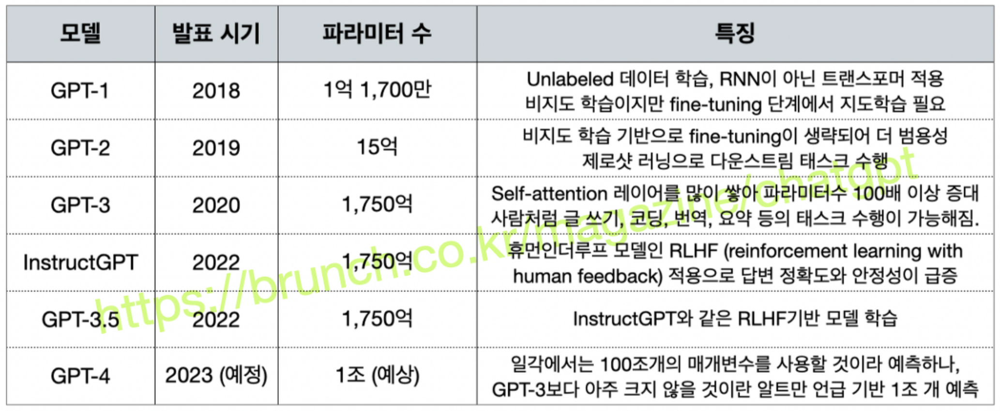

# 01. ChatGPT 개요

## ChatGPT의 전문 분야

### **자연어 처리(Natural Language Processing, NLP)**

- 인공지능이 사람의 언어를 처리하는 분야

### **자연어 처리의 종류**

1. 자연어 이해(Natural Language Understanding, NLU)
   - 여러가지 보기 중 정답을 선택
   - 예시) 메일 중 스팸 메일을 고르는 스팸 분류기
2. 자연어 생성(Natural Language Generation, NLG)
   - 텍스트를 인공지능이 스스로 생성
   - 예시) 한국어를 다른 나라 언어로 번역하는 번역기

## 트랜스포머의 등장

### ChatGPT를 지칭하는 용어

- 인공지능
- 트랜스포머
- 디코더
- 딥 러닝
- ...

### 인공 신경망(Artificial Neural Network, ANN)

***1.1 4개의 계층으로 이루어진 인공 신경망***

- 사람 뇌의 신경망에 영감 받아 만들어진 기술
- 예시) 알파고,  구글 번역기, 파파고

### 딥 러닝(Deep Learning)

- 인공 신경망이 쌓이고 쌓여서 깊은 층을 이루는 층이 많은 신경망을 학습시킴을 의미
- 인공 신경망의 크기를 표현할 때 파리미터(Parameter)가 많다는 용어를 사용한다. 그림 1.1에서 검은 선을 파라미터라고한다. 

> ChatGPT는 이러한 뉴런과 파라미터를 굉장히 많이 가진 거대한 신경망으로, 그 내부는 트랜스포머라는 구조로 되어있다.

### 신경망 종류

- 신경망 구조는 설계자의 의도와 용도에 따라 다양함
  - 컨볼루션 신경망(Convolutional Neural Network, CNN) : 이미지 분야
  - 순환 신경망(Recurrent Neural Network, RNN) : 주가, 텍스트 데이터 등과 같이 순서가 중요한 경우에 사용
  - 트랜스포머(Transformer) : 언어를 다른 나라 언어로 번역하기 위한 번역기 용도

### 트랜스포머

***1.2트랜스포머의 내부 구조***

- 구글 번역기 용도로 설계된 신경망으로 컨볼루션 신경망, 순환 신경망을 전혀 사용하지 않고 좋은 성능을 보여 많은 기업이 주류로 사용
- 내부 구조는 왼, 오른쪽 두개의 파트로 나누어져있으며 ChatGPT는 오른쪽 도형을 채택함

### 인코더와 디코더

- 트랜스포머의 왼쪽은 인코더, 오른쪽은 디코더이고 마치 레고처럼 겹겹히(num_layers) 다수의 층으로 이루어져있다.

- 왼쪽 인코더 블록은 자연어 이해(NLU)에 강하고, 오른쪽 디코더 블록은 자연어 생성(NLG)에 강하다.

  

**번역기의 예**

1. 한글 문장이 겹겹히 쌓여있는 인코더 블록의 입력으로 사용됨
2. 인코더 블록이 한글 문장의 구조, 의미등을 내부 인공 신경망을 통해 파악
3. 그림 1.2에서 보이는 것처럼 인코더 블록 상단의 화살표를 통해 디코더 블록으로 연결
4. 디코더 블록이 전달받은 정보를 바탕으로 영어 문장을 생성

**각 블록의 발전**

- 자연어 처리에 좋은 성능을 보이자 각 블록이 분리되서 발전하기 시작함
  - 인코더 블록
    - BERT(Bidirectional Encoder Representations from Transformers)
  - 디코더 블록
    - GPT(Generative Pre-trained Transformer)

**BERT vs GPT**

- 초기에는 각기 장점이 다르므로 라이벌 구도였음

- 하지만 BERT, GTP 같은 트랜스포머 모델은 학습 데이터가 많고, 모델이 크기가 커질수록(파라미터가 많을수록) 성능이 점점 좋아짐

- 거대한 GTP는 자연어 이해에도 뛰어나므로 사용처나 용도면에서 BERT보다 뛰어나졌음

- 여러 기업의 GPT들

  - GPT-3: 마이크로소프트의 1,740억 개의 파라미터를 가진 디코더 모델 
  - LaMDA: 구글의 1,370억 개의 파라미터를 가진 디코더 모델
  - 하이퍼클로바 : 네이버의 2,040억 개의 파라미터를 가진 디코더 모델

  > 불과 2018년만해도 GPT-1의 파라미터 개수는 1,700만 개였음

## OpenAI와 언어 모델 GPT

**OpenAI**

- 일론 머스크(테슬라 회장), 리드 호프먼(링크드인 회장), 피터 틸(클래리엄캐피탈 회장) 등이 공동 설립
- 2017년 구글이 트랜스포머를 제안한 이후, 2018년 트랜스포머의 디코더를 이용해 만든 GPT라는 모델을 소개했다.
- OpenAI의 [Improving Language Understanding by Generative Pre-Training]이라는 논문에서 소개된 GPT는 논문 제목 중 Generative Pre-Training의 약자를 딴 이름이다. 이는 GPT-1으로 불리게 되었다.

**GPT**

- GPT는 언어 모델(Language Model, LM)이다.
- 언어 모델이란 현재 알고 있는 단어를 기반으로 다음에 등장할 단어를 예측하는 일을 하는 모델
- 단어라는 단위가 언어 모델마다 다를 수 있어 문헌에선 토큰(token)이라 표현하기도 한다.

**언어 모델의 예**

- 검색 엔진 : 다음 단어를 미리 예상하고 추천

  

- ChatGPT : 질문 던졌을 때 마치 사람이 타이핑 하는 것처럼 다음에 등장할 단어를 순차적으로 작성(예측)하면서 답변을 완성

  

  > ***사전학습(Pre-Training)***
  >
  > GPT라는 언어모델이 뛰어난 성능을 보여주는 이유는 사전 학습이라는 개념에 기인한다. 위의 답변으로 보면 다양한 소스에서 수많은 텍스트를 읽고 학습한다고 표현한다.

## GPT 시리즈의 발전

**GPT 시리즈**

> 모델 간 큰 차이는 없으나, 모델 학습에 사용되는 데이터 크기, 입력으로 받을 수 있는 토큰의 수, 디코더 블록을 몇 개의 층으로 증가시켰냐에 따라 차이를 보인다.

## GPT의 오해와 한계

1. **ChatGPT의 실시간 학습 능력**

   - 프롬프트로 대화하다보면 ChatGPT가 실시간 학습을 하는 것 같지만, ChatGPT는 현재 이루어지고 있는 대화창(세션) 내에서만 이전 대화를 기억한다. 
     - 예시) 삼행시에 대해 가르쳤지만, 새로운 창을 띄우면 삼행시의 의미를 다시 기억 못할 수 있다.
   - 대화 안에서 만큼은 마치 실시간 학습을 한 것처럼 보이는 현상을 인컨텍스트 러닝(In-context learning)이라 한다.

   > *"특정 사용자의 비서나 개인화 된 시스템으로 사용하기를 원한다면 이 점을 반드시 고려해야한다."*

   

2. **ChatGPT가 알고 있는 지식의 기간**

   - 2022년 사건 관련 지식을 물어보면 잘못된 정보를 대답할 가능성이 높다. 지식 기간은 2021년까지이다.

   

3. **ChatGPT는 정보를 검색하지 않습니다**

   - 2021년까지의 데이터를 학습했지만, 학습하지 못한 데이터가 이씅ㄹ 수 있고 학습한 데이터라고 해도 기존 검색 엔진과 같이 원문을 그대로 가져오지 않는다.
   - 사람에게는 상식, 검색 엔진을 통해서는 쉽게 찾을 수 있는 지식이라도 잘못 대답할 수 있다.

   > *"사실성이 중요한 질문은 적합하지 않다."*

   

4. **ChatGPT는 추가 학습이 제공되지 않습니다**

   - ChatGPT를 자사 데이터로 추가 학습(fine-tuning)하여 서비스를 개발했다는 기업의 광고 유튜브가 많다. 하지만 이는 실제 ChatGPT로 연동하지 않았을 가능성이 매우 높다.
   - 2023년 2월 기준 ChatGPT는 추가 학습 기능을 제공하지 않는다. 대신 API 형식으로만 제공한다. 

   > *"OpenAPI의 형제 모델 중 davinci, curie, baddage, ada 등과 같은 모델은 추가 학습을 제공하므로 ChatGPT가 지원하기 전까지 섞어 쓰는 것을 권장한다."*

   

5. **ChatGPT는 숫자에 약합니다**

   - 언어 모델은 다음에 올 확률이 가장 높은 단어를 선택하며 텍스트를 작성하는 모델이다.
   - 특성상 숫자와 관련된 문제를 푸는 일에는 약하다.

   > *"생성된 텍스트에서 수치 정보가 틀렸을 수 있음을 염두에 두고 사용해야한다."*

   

6. **거짓말 주의: 할루시네이션(Hallucination)**

   - 언어 모델은 가장 확률이 높은 답변을 완성하지만 진실, 거짓 여부를 판단하는 능력은 없다.
   - 그럴듯 하지만 거짓을 섞어 생성하는 현상을 할루시네이션(Hallucination)이라 한다.

   > *"사실 여부가 중요한 경우(논문, 법령, 의사의 진단)에 완전히 의존하면 안된다."*

   

7. **이미지를 그리는 인공지능**

   - 더 적절한 모델인 달리(DALL-E), 미드저니(Midjourney), 스테이블 디퓨전(Stable Diffusion)의 사용을 추천한다

   > *"적절한 이미지 모델과 결합해서 사용해야한다."*

   

8. **ChatGPT는 사고하는 능력이 없습니다**

   - 인터넷의 수많은 텍스트 데이터를 기반으로 그럴듯한 답변을 할 뿐이다.

   > "*철학적이거나 논쟁이 많은 질문, 미래를 예측하는 질문을 던졌을 때 사람의 지식을 벗어난 특별한 방향성을 제안하기를 기대하는 것은 적절하지 않다.*"

   

9. **ChatGPT의 한글과 영어의 성능 차이**

   - 국내에서 만든 모델이 아니기 때문에 언어 별 성능 차이가 발생한다.
     - 속도 뿐 아니라 답변의 정확도나 텍스트의 질까지 포함한다.
   - 한글을 영어보다 더 긴 텍스트로 판단하기 때문에 답변이 잘리는 횟수가 많다.

