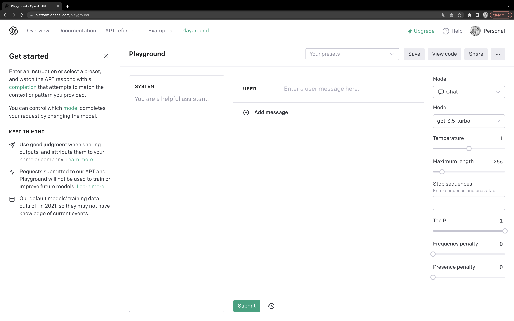

# 02. ChatGPT와 GPT-3 시작하기

## 회원가입 및 무료 버전 사용

생략

## 접속되지 않는 경우

- ChatGPT 무료 버전에서는 사용량이 많으면 접속이 되지 않음
- 대안으로 ChatGPT Plus를 사용하거나 OpenAI의 플레이그라운드를 대안으로 선택할 수 있음

## OpenAI의 다른 GPT 모델 사용해보기

***OpenAI Playground***

ChatGPT(GPT-3.5)를 사용할 수 없는 상황이라면 [OpenAI 플레이그라운드](https://platform.openai.com/playground)에 공개된 ChatGPT-3, GPT-3.5 등 다른 모델을 사용할 수 있다.

> 플레이 그라운드는 챗봇이라기보단 자동완성 툴이다.

### 다른 GPT 모델 사용해보기

오른쪽 위 Model 영역을 통해 모델을 변경할 수 있다.

- GPT-4 : 가장 뛰어난 모델 총 2가지 모델이 있음
  - 첫 번째 모델 : 8192개의 토큰을 처리함. GPT-3.5보다 2배의 처리 능력을 가짐
  - 두 번째 모델 : 32768개의 토큰을 처리함
- GPT-3.5 : 가장 많이 알려진 모델, Davinci와 동급의 가격을 제공하지만 추가 학습 기능 제공하지 않음
- Davinci : GPT-4, GPT-3.5를 제외하고 가장 뛰어나면서 가장 비싼 제품, GPT와 유사한 성능이지만 파라미터 값을 통해 섬세한 조작 가능
- Curie : Davinci 하위 호환
- Baddage : 간단한 짧은 텍스트 정정 및 분석에 사용
- Ada : 성능 가격은 Baddage와 큰 차이 없으나 가장 저렴한 모델

### 최대 길이(Maximum length)

AI 모델이 생성해내는 텍스트의 양을 조절하는 값이다. 주의할 점은 단위가 단어가 아닌 모델이 사용하는 토큰이다. 토큰 개수는 [여기](https://platform.openai.com/tokenizer)서 확인 가능하다.

> 짧은 답변을 원하는 경우 최대 길이를 짧게 줄이면 된다. 

### 온도 조절(Temperature)

온도(0~0.1)를 조절하여 답변의 랜덤성을 관리할 수 있다. 온도가 높을수록 더 창의적이고 낮은 온도일수록 좀 더 전형적이고 보수적인 텍스트를 생성한다.

### 빈도수 페널티와 존재 페널티

- 빈도수 페널티
  - 동일한 단어를 반복 생성하지 않게 도와준다. 단어가 얼마나 등장했는지에 따라 영향 받는다.
- 존재 페널티
  - 단어가 이미 텍스트에 있는 경우 등장 가능성을 줄인다. 빈도와는 관계 없다.

## ChatGPT Plus 사용하기

유료 버전인 Plus에서는 세 가지 버전의 ChatGPT가 사용 가능하다.

1. Default(GPT-3.5)
   - 더 빠른 답변을 얻을 수 있도록 속도에 최적화된 모델
   - 무료 버전에 비해 더 빠른 답변을 얻을 수 있음
2. Legacy(GPT-3.5)
   - 유료 버전이 제공하는 기본 모델
3. GPT-4
   - 가장 뛰어난 성능의 모델
   - 속도가 느리고 시간당 질문 횟수에 제한이 있음
   - 무료 버전 대비 약 2~8배의 토큰을 지원하여 긴 답변을 얻을 수 있음